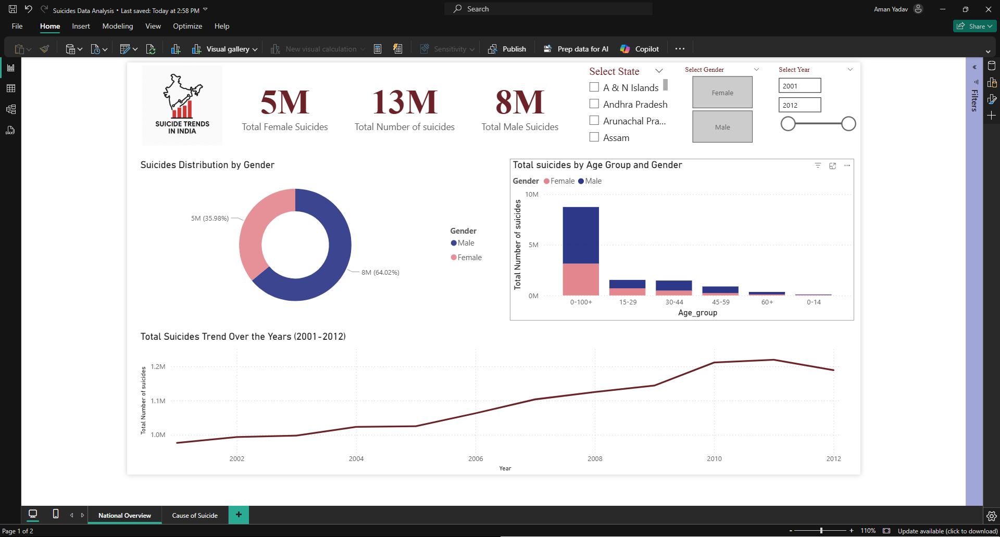

# 📊 Suicide Trends in India (2001–2012) – Power BI Dashboard

This Power BI project analyzes suicide trends across India from 2001 to 2012 using a publicly available dataset. The dashboard highlights demographic patterns, key causes of suicide, and yearly trends to understand this sensitive issue and promote data-driven insights.

---

## 📌 Project Objectives

- Understand suicide trends by **age**, **gender**, and **region**
- Identify **top causes of suicide** and their patterns
- Use **Power BI** to build a professional-level, interactive dashboard
- Strengthen data visualization and storytelling skills for job-readiness

---

## 📁 Project Structure

| File/Folder                         | Description                                      |
|------------------------------------|--------------------------------------------------|
| `Suicide_Analysis_India.pbix`      | Power BI project file                            |
| `Dataset/Suicides_in_India.csv`    | Source dataset (2001–2012)                       |
| `Images/National_Overview_Analysis.png` | Page 1 screenshot                          |
| `Images/Cause_of_Suicide.png`      | Page 2 screenshot                                |

---

## 🧠 Key Insights

- 📈 Suicides rose steadily from 2001 to 2012.
- 👨‍🦱 Males represent nearly **2/3 of all suicide cases**.
- 🧑‍🎓 **15–29** and **30–44** age groups are most affected.
- ⚠️ **Family issues**, **marital status**, and **education level** influence trends.
- 🏙️ States like **Maharashtra** and **West Bengal** have higher incident rates.

---

## 📊 Dashboard Walkthrough

### 📍 Page 1: National Overview

- Gender-wise suicide distribution
- Age group comparison by gender
- Suicide trend across years
- State-wise slicer and KPI cards

---

### 📍 Page 2: Cause of Suicide

- Gender-wise suicide by cause
- Total suicide by cause category (donut chart)
- Year-wise cause-wise suicide trends
- Highlighting top causes across years

> ⚠️ *Note: Map visuals were excluded due to tenant-level limitations.*

---

## 🛠 Tools & Techniques

- **Power BI Desktop**
  - Slicers, KPI Cards, DAX, Conditional Formatting
- **Data Cleaning** in Power Query
- **Custom visuals** and color palette
- **GitHub** for version control and portfolio showcase

---

## 🎓 Mentorship & Training

Developed under the guidance of **Internshala Trainings – Data Science with Generative AI** program.

**Special thanks to:**
- Uddipta Sarrma
- Arpit Sharma
- Sakshi Saxena

---

## 🙋 About Me

I'm **Aman Yadav**, a BSc IT graduate passionate about transforming raw data into meaningful stories. I’m currently upskilling in data analytics and generative AI.

- 🔗 [LinkedIn](https://www.linkedin.com/in/aman-yadav-6b64b6253/)
- 🧠 [Explore More Projects](https://github.com/Amanyadav-07)

---

## ⭐ Show Your Support

If you found this helpful, feel free to give this project a ⭐ on GitHub and share your feedback. It motivates me to create more!

---

